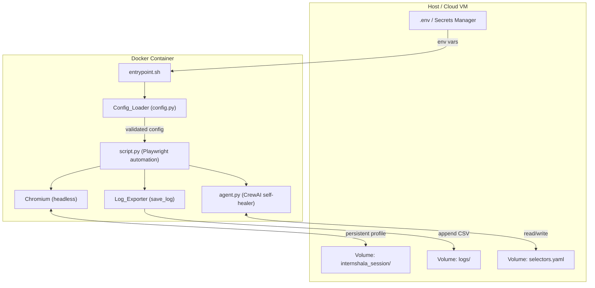

# Design Document: Internshala Bot Packaging

## Overview

This document describes the technical design for packaging the Internshala Automation Bot as a distributable, Docker-based product with cloud deployment support. The existing bot (`script.py` + `agent.py`) is a working Python/Playwright automation tool with a self-healing CrewAI agent. The packaging effort wraps it in a production-grade container, adds configuration management, persistent storage, CI/CD, and a user-facing setup experience — without modifying the core automation logic.

The two primary deployment targets are:
1. **Local/self-hosted**: `docker compose up` with a `.env` file
2. **Cloud**: Stateless container deployable to ECS, Cloud Run, or ACI on a schedule

---

## Architecture



### Key Design Decisions

- **Entrypoint shell script** (`entrypoint.sh`) handles pre-flight checks (copy default `selectors.yaml` if missing, create `logs/` dir) before delegating to `python script.py`.
- **Config_Loader** (`config.py`) is a new thin module imported by `script.py` that reads, validates, and exposes all env-var-driven configuration. This keeps `script.py` changes minimal.
- **Non-root user** (`botuser`, UID 1000) is created in the Dockerfile; all app files are owned by this user.
- **Multi-stage Dockerfile** is not used here because Playwright requires the browser binary at runtime, not just build time. A single-stage image with layer caching is sufficient to stay under 2 GB.
- **Volumes** for session, selectors, and logs are declared in `docker-compose.yml` so data survives container restarts without baking state into the image.

---

## Components and Interfaces

### Config_Loader (`config.py`)

Responsible for reading all runtime configuration from environment variables, validating required fields, and exposing a typed `BotConfig` dataclass to the rest of the application.

```python
@dataclass
class BotConfig:
    username: str           # INTERNSHALA_USERNAME (required)
    password: str           # INTERNSHALA_PASSWORD (required)
    openai_api_key: str     # OPENAI_API_KEY (required)
    keywords: list[str]     # BOT_KEYWORDS (optional, default list)
    dry_run: bool           # BOT_DRY_RUN (optional, default False)
    headed: bool            # BOT_HEADED (optional, default False)

def load_config() -> BotConfig:
    """Reads env vars, raises RuntimeError on missing required vars."""
    ...
```

`load_config()` raises `RuntimeError("Missing required environment variable: <NAME>")` for any absent or empty required variable.

### Entrypoint (`entrypoint.sh`)

Shell script set as `ENTRYPOINT` in the Dockerfile. Responsibilities:
1. If `/app/selectors.yaml` (the mounted path) does not exist, copy `/app/selectors.yaml.default` (baked into image) to the mount point.
2. Create `/app/logs/` if absent.
3. Exec `python script.py "$@"` passing through all CLI flags.

### Dockerfile

Single-stage build based on `python:3.11-slim`. Key layers:
1. Install OS-level deps for Playwright (`libnss3`, `libatk1.0-0`, etc.)
2. `COPY requirements.txt` + `pip install`
3. `RUN playwright install chromium --with-deps`
4. `COPY` application source
5. `RUN useradd -m -u 1000 botuser && chown -R botuser /app`
6. `USER botuser`
7. `ENTRYPOINT ["./entrypoint.sh"]`

### docker-compose.yml

Defines:
- `bot` service built from local Dockerfile
- `env_file: .env`
- Named volumes: `session_data`, `log_data`, `selector_data`
- `restart: on-failure`
- `healthcheck` using `pgrep -f script.py`

### CI/CD Pipeline (`.github/workflows/docker.yml`)

GitHub Actions workflow:
- Trigger: push to `main`, push of version tags (`v*`)
- Steps: checkout → Docker layer cache (buildx + cache-to/from) → build → smoke test → conditional push on tag

### cloud-deploy/

Contains reference deployment configs:
- `ecs-task-definition.json` — AWS ECS Fargate task definition
- `cloudrun-service.yaml` — GCP Cloud Run service manifest

### Smoke Test (`tests/smoke_test.sh`)

Bash script that:
1. Starts the container with `BOT_DRY_RUN=true` and mock/real credentials
2. Waits for exit
3. Asserts exit code `0`
4. Asserts at least one line with `dry_run` in the log CSV
5. Asserts completion within 120 seconds

---

## Data Models

### BotConfig (runtime, in-memory)

| Field | Type | Source | Required | Default |
|---|---|---|---|---|
| `username` | `str` | `INTERNSHALA_USERNAME` | Yes | — |
| `password` | `str` | `INTERNSHALA_PASSWORD` | Yes | — |
| `openai_api_key` | `str` | `OPENAI_API_KEY` | Yes | — |
| `keywords` | `list[str]` | `BOT_KEYWORDS` (CSV) | No | `["AI","ML","SWE","Web Dev","Frontend","Backend"]` |
| `dry_run` | `bool` | `BOT_DRY_RUN` | No | `False` |
| `headed` | `bool` | `BOT_HEADED` | No | `False` |

### Application Log Record (CSV row)

| Field | Type | Description |
|---|---|---|
| `company` | `str` | Company name from listing |
| `role` | `str` | Internship role title |
| `date_applied` | `str` | ISO 8601 timestamp |
| `listing_url` | `str` | Full URL of the listing |
| `status` | `str` | `"applied"` or `"dry_run"` |

Written to `/app/logs/internshala_applied.csv` (append-only, no header row truncation).

### selectors.yaml (Selector_Store)

Existing YAML structure managed by `agent.py`. The image bakes a copy as `selectors.yaml.default`; the entrypoint copies it to the mounted volume path on first run. The agent reads and writes the mounted path at runtime.

### Environment Variables Contract

| Variable | Required | Type | Description |
|---|---|---|---|
| `INTERNSHALA_USERNAME` | Yes | string | Login email |
| `INTERNSHALA_PASSWORD` | Yes | string | Login password |
| `OPENAI_API_KEY` | Yes | string | OpenAI API key for self-healing agent |
| `BOT_KEYWORDS` | No | CSV string | Comma-separated search keywords |
| `BOT_DRY_RUN` | No | `"true"/"false"` | Enable dry-run mode |
| `BOT_HEADED` | No | `"true"/"false"` | Launch Chromium in headed mode |

---

## Correctness Properties

*A property is a characteristic or behavior that should hold true across all valid executions of a system — essentially, a formal statement about what the system should do. Properties serve as the bridge between human-readable specifications and machine-verifiable correctness guarantees.*

### Property 1: Missing required env var causes non-zero exit

*For any* combination of absent or empty values among `INTERNSHALA_USERNAME`, `INTERNSHALA_PASSWORD`, and `OPENAI_API_KEY`, the Config_Loader SHALL raise a `RuntimeError` and the process SHALL exit with a non-zero status code.

**Validates: Requirements 1.4, 2.6**

---

### Property 2: BOT_KEYWORDS parsing round-trip

*For any* non-empty comma-separated string supplied as `BOT_KEYWORDS`, parsing it through `load_config()` and then joining the resulting list back with `","` SHALL produce a string equal to the original input (after stripping surrounding whitespace from each token).

**Validates: Requirements 2.2**

---

### Property 3: BOT_DRY_RUN case-insensitive parsing

*For any* string value of `BOT_DRY_RUN` that is a case-insensitive match for `"true"`, `load_config()` SHALL return `dry_run=True`; for any other value it SHALL return `dry_run=False`.

**Validates: Requirements 2.3**

---

### Property 4: BOT_HEADED case-insensitive parsing

*For any* string value of `BOT_HEADED` that is a case-insensitive match for `"true"`, `load_config()` SHALL return `headed=True`; for any other value it SHALL return `headed=False`.

**Validates: Requirements 2.4**

---

### Property 5: Log append-only invariant

*For any* sequence of application records written via `save_log()`, the total number of rows in the CSV file SHALL be monotonically non-decreasing — no prior record SHALL be removed or overwritten by a subsequent write.

**Validates: Requirements 4.3**

---

### Property 6: Log directory auto-creation

*For any* state where the `logs/` directory does not exist at the time `save_log()` is first called, the function SHALL create the directory and successfully write the record without raising an exception.

**Validates: Requirements 4.4**

---

### Property 7: Dry-run records carry correct status

*For any* internship listing processed in dry-run mode, the log record written by `save_log()` SHALL have `status == "dry_run"`.

**Validates: Requirements 10.3**

---

### Property 8: Config_Loader identifies missing variable by name

*For any* missing required variable, the `RuntimeError` message raised by `load_config()` SHALL contain the exact name of the missing variable as a substring.

**Validates: Requirements 2.6**

---

## Error Handling

| Scenario | Component | Behavior |
|---|---|---|
| Missing required env var | Config_Loader | `RuntimeError` with variable name; process exits non-zero |
| `selectors.yaml` absent at container start | entrypoint.sh | Copy default from image; log warning to stdout |
| `logs/` directory absent | Log_Exporter (`save_log`) | `mkdir -p` then write; no exception raised |
| Playwright `TimeoutError` on selector | `robust_wait_and_click` | Trigger `agent.heal_selectors()`; retry once; mark unhealable on second failure |
| Self-healing agent returns `FAILURE` | `agent.heal_selectors` | Return `False`; caller skips listing; add selector to `UNHEALABLE_SELECTORS` cache |
| CAPTCHA detected in headed mode | `login_to_internshala` | Print human-readable prompt to stdout; wait up to 1600 seconds for manual solve |
| Smoke test missing Playwright binary | `tests/smoke_test.sh` | Print diagnostic identifying missing component; exit non-zero |
| CI smoke test exits non-zero | GitHub Actions | Fail build; do not push image to Registry |

---

## Testing Strategy

### Dual Testing Approach

Both unit tests and property-based tests are required. Unit tests cover specific examples, integration points, and error conditions. Property-based tests verify universal correctness across randomized inputs.

### Unit Tests (`tests/test_config.py`, `tests/test_log.py`)

- Verify `load_config()` raises `RuntimeError` for each missing required variable individually
- Verify `load_config()` returns correct defaults when optional vars are absent
- Verify `save_log()` creates the log directory if absent
- Verify `save_log()` appends without truncating existing rows
- Verify entrypoint copies default `selectors.yaml` when mount is empty (integration test via subprocess)

### Property-Based Tests (`tests/test_properties.py`)

Using **Hypothesis** (Python property-based testing library). Each test runs a minimum of **100 iterations**.

**Property 1 — Missing required env var causes non-zero exit**
```
# Feature: internshala-bot-packaging, Property 1: missing required env var causes RuntimeError
```
Generate random subsets of `{INTERNSHALA_USERNAME, INTERNSHALA_PASSWORD, OPENAI_API_KEY}` with at least one absent; assert `load_config()` raises `RuntimeError` containing the missing variable name.

**Property 2 — BOT_KEYWORDS parsing round-trip**
```
# Feature: internshala-bot-packaging, Property 2: BOT_KEYWORDS parsing round-trip
```
Generate random lists of non-empty strings; join with `","` as `BOT_KEYWORDS`; assert `load_config().keywords` equals the original list (after strip).

**Property 3 — BOT_DRY_RUN case-insensitive parsing**
```
# Feature: internshala-bot-packaging, Property 3: BOT_DRY_RUN case-insensitive parsing
```
Generate random mixed-case permutations of `"true"` and arbitrary non-`"true"` strings; assert `load_config().dry_run` is `True` iff the value is case-insensitively `"true"`.

**Property 4 — BOT_HEADED case-insensitive parsing**
```
# Feature: internshala-bot-packaging, Property 4: BOT_HEADED case-insensitive parsing
```
Same pattern as Property 3 for `BOT_HEADED`.

**Property 5 — Log append-only invariant**
```
# Feature: internshala-bot-packaging, Property 5: log append-only invariant
```
Generate random sequences of log records; call `save_log()` for each; assert row count equals the number of records written and no prior row is missing.

**Property 6 — Log directory auto-creation**
```
# Feature: internshala-bot-packaging, Property 6: log directory auto-creation
```
For a random temp directory path that does not exist, call `save_log()` with a valid record; assert the directory was created and the file contains the record.

**Property 7 — Dry-run records carry correct status**
```
# Feature: internshala-bot-packaging, Property 7: dry-run records carry correct status
```
Generate random company/role strings; call `save_log()` with `status="dry_run"`; read back the CSV and assert the last row has `status == "dry_run"`.

**Property 8 — Config_Loader identifies missing variable by name**
```
# Feature: internshala-bot-packaging, Property 8: Config_Loader identifies missing variable by name
```
For each required variable name, call `load_config()` with that variable absent; assert the `RuntimeError` message contains the variable name as a substring.
